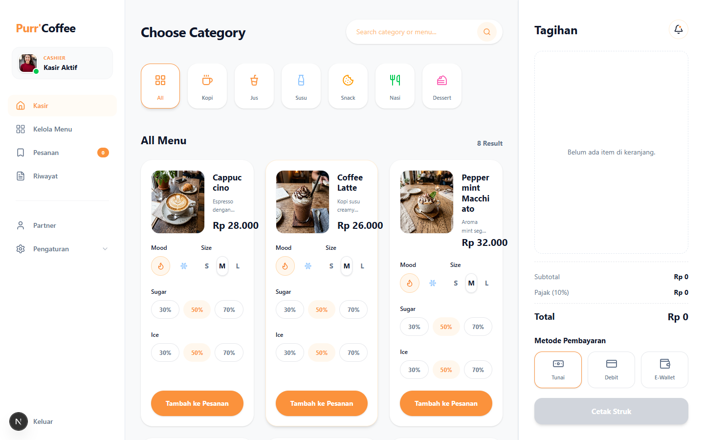
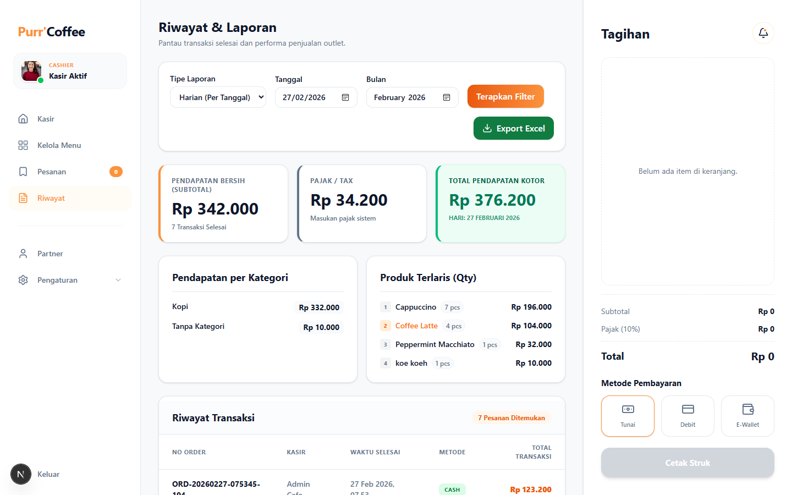
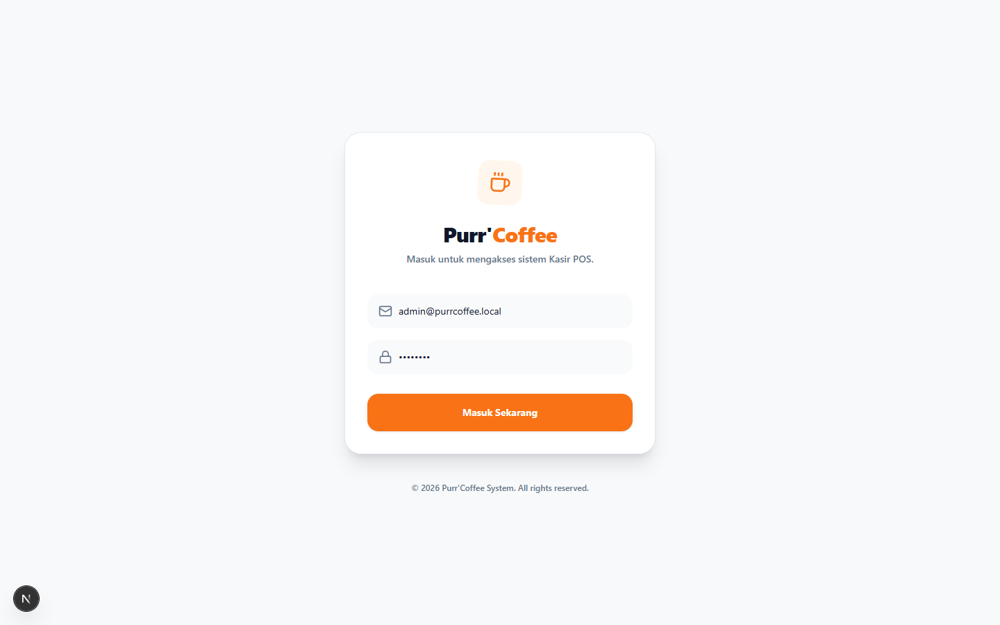

# POS Kasir Cafe (Next.js + MySQL)

Aplikasi Point of Sale (POS) untuk cafe yang dibangun dengan Next.js App Router, TypeScript, Tailwind CSS, dan MySQL.

Fitur utama mencakup kasir transaksi, manajemen menu dan stok, pengelolaan partner, riwayat transaksi, laporan harian/bulanan, serta export Excel.

## Tampilan Aplikasi

### Halaman Kasir (POS)


### Halaman Riwayat Transaksi & Laporan


### Halaman Login


## Fitur Utama

- Autentikasi login sederhana berbasis cookie session.
- Halaman kasir interaktif (pilih kategori, atur varian produk, keranjang, metode bayar).
- Cetak struk 80mm langsung dari browser (`window.print`).
- Manajemen menu: tambah produk, upload gambar, update stok, hapus produk.
- Modul pesanan aktif: tandai status order dari `Diproses` ke `Selesai`.
- Riwayat transaksi + ringkasan laporan (pendapatan, kategori terlaris, produk terlaris).
- Export data riwayat ke file `.xlsx`.
- Pengaturan toko: nama, alamat, telepon, pajak, serta data outlet.

## Tech Stack

- Next.js 16 (App Router)
- React 19
- TypeScript
- Tailwind CSS 4
- MySQL (`mysql2`)
- Lucide React (icon)
- `xlsx` (export Excel)

## Struktur Proyek

```txt
.
|- database/
|  `- schema.sql
|- public/
|  `- images/
|- src/
|  |- app/
|  |  |- (dashboard)/
|  |  |- login/
|  |  |- layout.tsx
|  |  `- providers.tsx
|  |- components/
|  `- lib/
|     |- actions/
|     |- cart-context.tsx
|     `- db.ts
`- package.json
```

## Persyaratan

- Node.js 20+
- npm 10+
- MySQL 8+

## Instalasi

```bash
git clone <repo-url>
cd <nama-repo>
npm install
```

## Konfigurasi Environment

Buat file `.env.local` di root project:

```env
DB_HOST=127.0.0.1
DB_PORT=3306
DB_USER=root
DB_PASSWORD=
DB_NAME=pos_kasir_cafe
SESSION_SECRET=ganti-dengan-random-string-panjang
```

Catatan: jika tidak diisi, aplikasi tetap memakai nilai default seperti di `src/lib/db.ts`.

## Setup Database

Jalankan schema SQL untuk membuat database, tabel, dan seed data awal:

```bash
mysql -u root -p < database/schema.sql
```

Seed data mencakup akun admin, kategori, produk contoh, stok awal, dan pengaturan toko.

## Menjalankan Aplikasi

```bash
npm run dev
```

Buka di browser: `http://localhost:3000`

## Akun Login Default

| Role  | Email                   | Password |
|-------|-------------------------|----------|
| Admin | admin@purrcoffee.local  | admin123 |

## Scripts

- `npm run dev` - jalankan mode development.
- `npm run build` - build aplikasi production.
- `npm run start` - jalankan hasil build.
- `npm run lint` - jalankan ESLint.

## Catatan Implementasi

- Data access menggunakan Server Actions (`src/lib/actions/*`).
- Upload gambar produk disimpan ke `public/images`.
- Middleware (`src/middleware.ts`) melindungi semua route selain `/login` dan aset statis.
- Nilai `outletId` dan `userId` default saat ini menggunakan `1` (mode single outlet sederhana).
- Password pada seed saat ini masih plain text (disarankan hashing untuk production).

## Rute Utama

- `/login` - halaman login.
- `/` - kasir utama.
- `/menu` - kelola menu dan stok.
- `/orders` - pesanan aktif.
- `/history` - riwayat transaksi dan laporan.
- `/partners` - data partner/supplier.
- `/settings` - pengaturan toko dan outlet.

## Troubleshooting Singkat

- Gagal konek DB: cek `.env.local`, service MySQL, dan user/password.
- Login gagal: pastikan seed database sudah ter-import dari `database/schema.sql`.
- Gambar produk tidak muncul: pastikan folder `public/images` dapat ditulis aplikasi.

## Lisensi

Belum ada lisensi resmi di repository ini.
